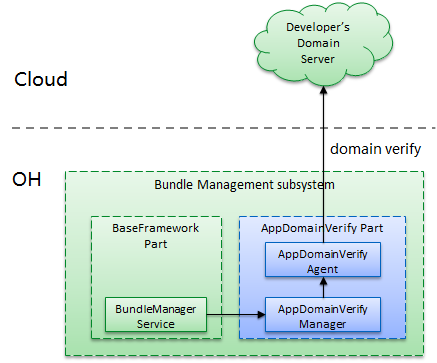

# AppDomainNameVerify

## Introduction

AppDomainNameVerify is a part of the bundle management subsystem. It works with the BaseFramework part and ability framework to provide the App Linking$^1$ feature. The main functions of AppDomainNameVerify are as follows:

- During application installation, AppDomainNameVerify communicates with the domain server associated with the application, verifies the mapping between the application and domain name, and saves the mapping.
- When a link is clicked, AppDomainNameVerify filters the ability of the application associated with the domain name based on the saved mapping.

> **NOTE**
>
> App Linking redirects users from different platform to your in-app content. Compared with Deep Link, App Linking is more secure and reliable and provides better user experience.

### Architecture

**Figure 1** Architecture of AppDomainNameVerify



### Process

#### Interaction with BundleManagerService

* During application installation, BundleManagerService calls the domain name verification API of AppDomainNameVerify to obtain the asset configuration file of all HTTPS domain names declared in **module.json5**. It checks whether any field of the **apps** array in the asset configuration file matches the current application. If so, the verification is successful. Otherwise, the verification fails.
* During application uninstall, BundleManagerService calls the deletion API of AppDomainNameVerify to delete the verification result of the application.
* During application update, BundleManagerService calls the APIs of AppDomainNameVerify to delete the verification result of the application and then initiate a new round of verification.
* When **startAbility()** is called to trigger an inter-application implicit redirection, BundleManagerService passes in the want (implicit redirection, with an HTTPS URI) and abilities and transfers them to AppDomainNameVerify. Based on the cached mappings between the applications matching the passed-in abilities and the URI domain name in the want, AppDomainNameVerify obtains the ability of the application that passes the verification and sends that ability to BundleManagerService for more accurate redirection.

#### Periodic Update

If the verification fails, AppDomainNameVerify automatically updates the verification result on a regular basis after the device is powered on.

## Directory Structure

```text
/foundation/bundlemanager/app_domain_verify/
├── etc                      # Process configuration files
├── figures                  	# Architecture
├── interfaces               # APIs provided for external systems
│   └── inner_api            # Inner APIs
├── profile                  # System service configuration files
├── services                 # Feature implementation code
├── test                     # Test code
└──README.en.md              # Instructions for use
```

## Build

In the root directory of the OpenHarmony source code, call the following command to compile **app_domain_verify** separately:

```shell
./build.sh --product-name rk3568 --ccache --build-target app_domain_verify
```

> **NOTE**
> - --**product-name**: product name, for example, **Hi3516DV300** and **rk3568**.
> - --**ccache**: cache used during the build.
> - --**build-target**: part to build.

## Inner API Development Guide

### Available APIs

#### app_domain_verify_mgr_client.h

Import the following header file before API calling:

```c++
#include "app_domain_verify_mgr_client.h"
```

|API|Description|
|---|---|
|VerifyDomain(const std::string &appIdentifier, const std::string &bundleName, const std::string &fingerprint, const std::vector<SkillUri> &skillUris): void|Called by BundleManagerService to trigger application domain name verification during application installation and update.|
|ClearDomainVerifyStatus(const std::string &appIdentifier, const std::string &bundleName): bool|Called by BundleManagerService to clear the application verification information during application uninstall. The return value indicates whether the clearance is successful.|
|FilterAbilities(const OHOS::AAFwk::Want &want, const std::vector<OHOS::AppExecFwk::AbilityInfo> &originAbilityInfos, std::vector<OHOS::AppExecFwk::AbilityInfo> &filtedAbilityInfos): bool|Called by BundleManagerService to find, from **AbilityInfos**, the ability of the application that passes the verification based on the HTTPS domain name in the want, when **startAbility** is used for inter-application implicit redirection. The return value indicates whether the filtering is successful.|

#### skill_uri.h

**skill_uri** information structure

|Name|Type|Description|
|----|----|----|
| scheme | std::string | Protocol name of the URI.       |
| host | std::string | Host address of the URI.   |
| port  | std::string | Port of the URI. |
| path| std::string | Path of the URI. Set **path**, **pathStartWith**, or **pathRegex** as needed. |
| pathStartWith| std::string |  Path of the URI. Set **path**, **pathStartWith**, or **pathRegex** as needed. |
| pathRegex| std::string |  Path of the URI. Set **path**, **pathStartWith**, or **pathRegex** as needed. |
| type| std::string | Data type that matches the want. The value complies with the Multipurpose Internet Mail Extensions (MIME) type specification. |

### How to Develop

1. Add dependencies to bundle.json.

   ```json
   "deps": {
     "components": [
       "app_domain_verify"
     ]
   }
   ```

2. Add the dependency on the client module to the .gn file.

   ```gn
   external_deps = [
     "app_domain_verify:app_domain_verify_mgr_client",
     "app_domain_verify:app_domain_verify_common"
   ]
   ```

3. Import the header file of the client to the header file.

   ```c++
   #include "app_domain_verify_mgr_client.h"
   ```

4. Call the APIs.

   Call the APIs by referring to the description in [Available APIs](#available-apis) to verify the domain name.