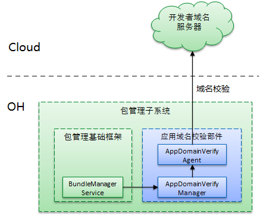

# 应用域名校验部件

## 简介

应用域名校验部件是包管理子系统中的一个部件，其与包管理基础框架，元能力管理服务，互相协作共同完成`Applinking`$^1$功能。该部件主要功能为：

1. 在应用的安装阶段，与应用关联的域名服务器进行通信，校验应用与域名的双向关联关系，并保存该关联关系。
1. 在打开链接时，根据保存的关联关系，过滤出域名关联的应用的ability。

*注释：*

1. Applinking是一种链接跳转技术，是一种通过https链接直接将用户带到应用程序中的特定内容的技术。相比Deeplink，Applinking技术更加安全可靠，体验也更佳。

### 架构图



**图 1**  应用域名校验部件架构图

### 基本流程

#### 与包管理的交互

* 应用安装时，包管理调用该部件的校验域名接口，获取应用module.json5中声明所有的https域名下的资产配置文件，校验资产配置文件apps数组字段中是否存在项匹配当前应用，如存在则在当前域名下校验成功，否则失败。
* 应用卸载时，包管理调用该部件的删除接口，删去当前应用的校验结果。
* 应用更新时，包管理会调用该部件的接口先删除当前应用的校验结果，再重新发起校验。
* 当应用间使用startAbility进行应用间隐式跳转时，包管理会将Want(隐式跳转，uri为一个https链接)和初筛出的待跳转Ability作为入参，传递给应用域名校验部件，部件根据入参Ability所在应用与Want中uri域名的校验关系缓存，过滤出校验成功的应用的Ability，传回给包管理，完成更精确地应用间跳转。

#### 周期刷新

应用域名校验部件会在设备完成开机后以及固定的时间周期内主动刷新校验失败的应用校验结果。

## 代码目录

```text
/foundation/bundlemanager/app_domain_verify/
├── etc                      # 组件包含的进程的配置文件
├── figures                  # 架构图
├── interfaces               # 组件对外提供的接口代码
│   └── inner_api            # 内部接口存放目录
├── profile                  # 组件包含的系统服务的配置文件
├── services                 # 应用域名校验服务实现
├── test                     # 测试相关代码
└──README_ZH.md              # 使用说明
```

## 编译构建

在OpenHarmony源码根目录下，调用以下指令，单独编译app_domain_verify。

```shell
./build.sh --product-name rk3568 --ccache --build-target app_domain_verify
```

> **说明：**
--product-name：产品名称，例如Hi3516DV300、rk3568等。
--ccache：编译时使用缓存功能。
--build-target: 编译的部件名称。

## Inner API开发指导

### 接口说明

#### app_domain_verify_mgr_client.h

接口调用需要引入以下头文件。

```c++
#include "app_domain_verify_mgr_client.h"
```

|接口|说明|
|---|---|
|`VerifyDomain(const std::string &appIdentifier, const std::string &bundleName, const std::string &fingerprint, const std::vector<SkillUri> &skillUris)：void`|提供给BundleManagerService使用，在应用安装和更新时调用，用于触发应用域名校验任务。|
|`ClearDomainVerifyStatus(const std::string &appIdentifier, const std::string &bundleName)：bool`|提供给BundleManagerService使用，在应用卸载时调用，用于清理被卸载应用的校验信息。返回值用于判断是否成功清理。|
|`FilterAbilities(const OHOS::AAFwk::Want &want, const std::vector<OHOS::AppExecFwk::AbilityInfo> &originAbilityInfos, std::vector<OHOS::AppExecFwk::AbilityInfo> &filtedAbilityInfos)：bool`|提供给BundleManagerService使用，当应用间使用startAbility进行应用间隐式跳转时，从入参AbilityInfos中筛选出所在应用与want中https域名校验成功的部分。返回值用于判断是否筛选成功。|

#### skill_uri.h

skill_uri 信息结构体。

|属性|类型|描述|
|----|----|----|
| scheme | std::string | URI的协议名部分。        |
| host | std::string | URI的主机地址部分。    |
| port  | std::string | URI的端口部分。  |
| path| std::string | URI的路径部分，path、pathStartWith和pathRegex配置时三选一。  |
| pathStartWith| std::string |  URI的路径部分，path、pathStartWith和pathRegex配置时三选一。  |
| pathRegex| std::string |  URI的路径部分，path、pathStartWith和pathRegex配置时三选一。  |
| type| std::string | 标识与Want相匹配的数据类型，使用MIME类型规范。  |

### 开发步骤

#### 在bundle.json中加入依赖

```json
"deps": {
  "components": [
    "app_domain_verify"
  ]
}
```

#### 在模块gn文件中加入对客户端模块的依赖

```gn
external_deps = [
  "app_domain_verify:app_domain_verify_mgr_client",
  "app_domain_verify:app_domain_verify_common"
]
```

#### 在头文件中引入客户端的头文件

```c++
#include "app_domain_verify_mgr_client.h"
```

#### 调用接口

参考`接口说明`章节调用接口，完成域名校验相关功能。
